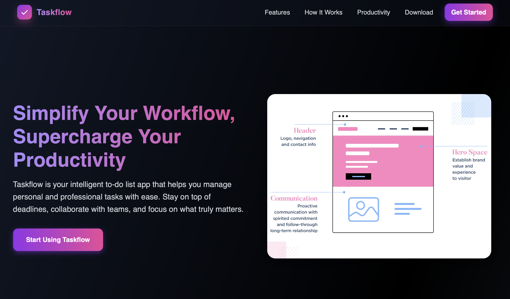
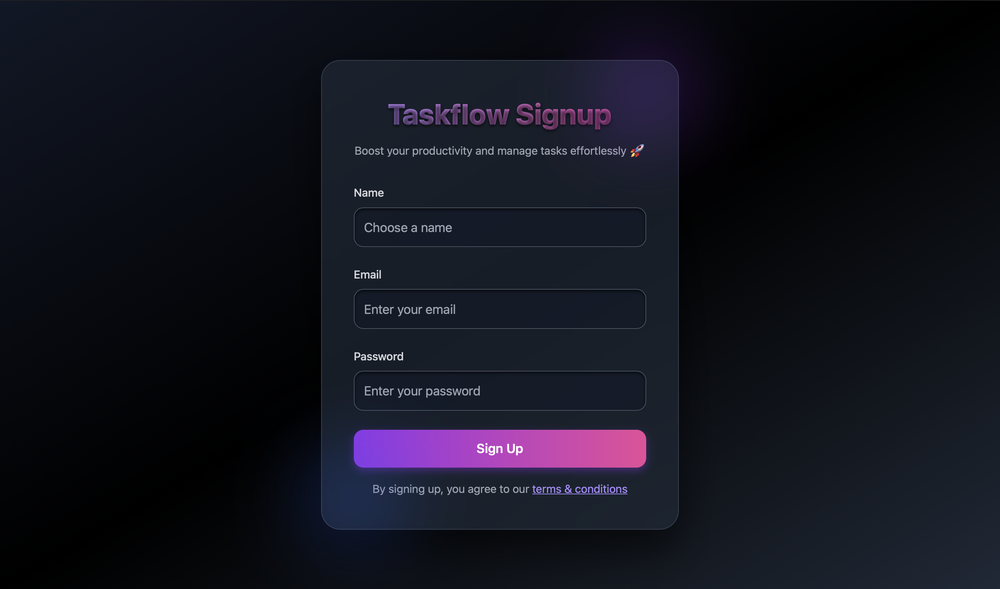
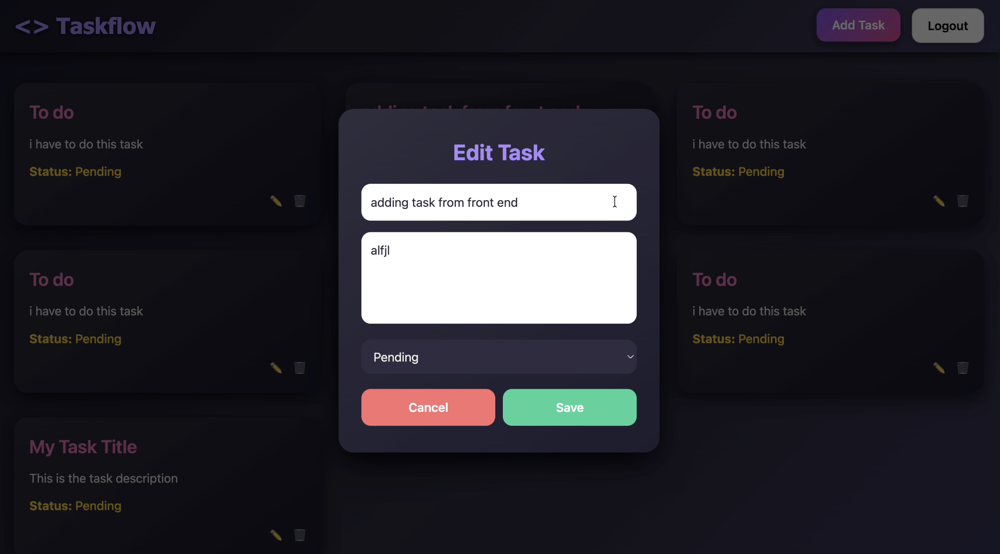

# 📝 ToDoList App with Admin Dashboard

A **complex ToDoList application** built for real-world task flow management. The app supports user registration, task CRUD (create, read, update, delete), image uploads, and a full **admin dashboard** that can fetch & manage all users and their to‑do lists.

---

## 🚀 Features

* 🔑 **User Registration & Authentication** — Sign up, login, protected routes (JWT)
* 📋 **Task Management** — Add, edit, delete, and fetch tasks
* 👥 **Admin Dashboard** — View user lists, fetch each user’s tasks, and manage accounts
* 🖼️ **Image Uploads** — Attach images to tasks or user profiles (stored in `frontend/public` or cloud)
* 📊 **Centralized Data Fetching** — Admin can query all users and all tasks
* ✅ **Role-based access** — Separate user and admin views/permissions

---

## 📸 Screenshots (place images in `frontend/public/`)

### 🖼️ Banner



### 🔑 Registration



### 📋 All Tasks Fetched


### ✏️ Edit Task




---


## 📁 Project structure (example)

```
/todolist-app
  /backend      # API, auth, DB models
  /frontend     # React app (public/, src/)
    /public
      banner.png
      register.png
      alltasks.png
      edit.png
```

---

## ⚙️ Quickstart (local)

1. **Clone repo**

```bash
git clone https://github.com/your-username/todolist-app.git
cd todolist-app
```

2. **Backend**

```bash
cd backend
npm install
# create .env from example and edit values
cp .env.example .env
# .env example values
# MONGO_URI=mongodb+srv://<user>:<pass>@cluster.example.mongodb.net/mydb
# JWT_SECRET=your_jwt_secret
# PORT=5000

npm run dev    # (or `npm start` depending on your scripts)
```

3. **Frontend**

```bash
cd ../frontend
npm install
# If needed, set API URL in environment (e.g. REACT_APP_API_URL=http://localhost:5000)
npm start
```

Open the frontend (usually at `http://localhost:3000`) and the backend at the port set in `.env`.

---

## 🔌 API (example endpoints)

> These are example routes — adapt to your implementation.

* `POST /api/auth/register` — Register user (accepts profile image)
* `POST /api/auth/login` — Login (returns JWT)
* `GET /api/tasks` — Fetch logged-in user tasks
* `POST /api/tasks` — Create a task (supports image)
* `PUT /api/tasks/:id` — Update a task
* `DELETE /api/tasks/:id` — Delete a task
* `GET /api/admin/users` — Admin: list all users
* `GET /api/admin/users/:id/tasks` — Admin: fetch one user’s tasks

---


## 💡 Notes & recommendations

* **Image handling**: For production, prefer cloud storage (e.g., Cloudinary / S3) instead of committing images to the repo. Keep `public/` for demo screenshots and placeholders.
* **Validation & security**: Validate uploads, sanitize inputs, and protect admin routes with role checks.
* **Pagination & filtering**: If many users/tasks exist, add pagination and filters on admin endpoints.

---

## 🛠️ Tech Stack (suggested)

* Frontend: React.js
* Backend: Node.js + Express
* Database: MongoDB (Mongoose)
* Auth: JWT
* Image storage: Local `public/` for demo, Cloudinary/AWS S3 for production

---

## 🤝 Contributing

1. Fork the repo
2. Create a feature branch (`git checkout -b feature/your-feature`)
3. Commit changes (`git commit -m "feat: describe feature"`)
4. Push to the branch and open a PR

---


## 📬 Questions / Contact

If you have questions, open an issue or reach out via your GitHub profile. Happy building! 🎉
# TaskFlow
