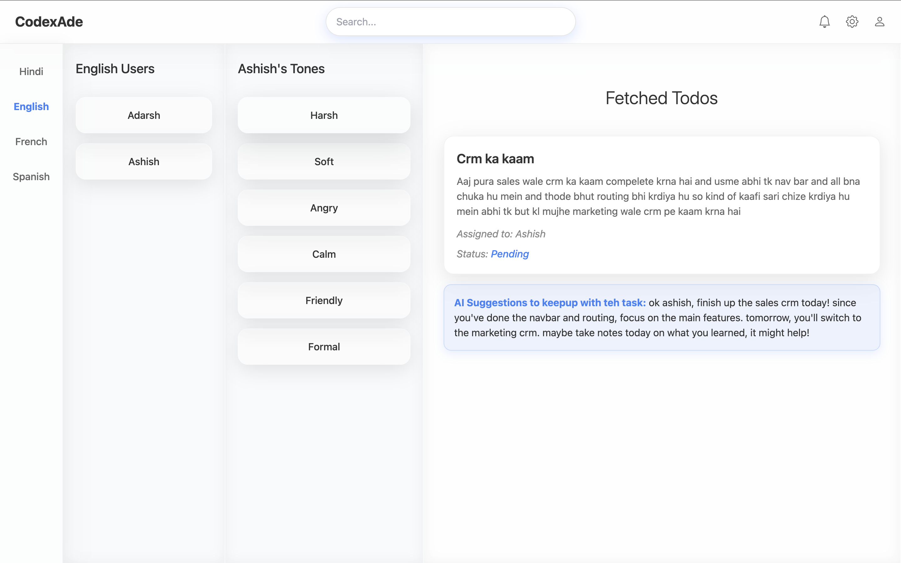

# TaskFlow — AI-powered Centralized User Tracking & Admin Dashboard



A polished platform to monitor, analyze, and manage all platform users from a single pane of glass. TaskFlow replaces the simple to‑do metaphor with a robust centralized tracking system: user health, activity timelines, anomaly detection, and AI-generated insights to help product, ops, and support teams act faster.

---

## 🚀 High-level capabilities

* 👥 Centralized User Directory — Browse every user, profiles, metadata, and recent activity.
* 📈 Activity & Session Tracking — View timelines, session summaries, and event feeds per user.
* 🤖 Generative AI Insights — Auto-summaries, churn risk scoring, and suggested next actions for support.
* 🛠 Admin Controls — Search, filter, suspend, annotate, and export user data with role-based permissions.
* 🖼️ Attachments & Media — Upload screenshots or profile images (store demo images in `frontend/public`).
* ⚠️ Anomaly Detection & Alerts — Detect unusual patterns and notify teams.

---

## 📸 Screenshots (place images in `frontend/public/`)

### 🖼️ Banner


### 🔑 Registration


### 📋 All Tasks Fetched (repurposed view: user lists / activity)


### ✏️ Edit Task (repurposed view: edit user / note)


---

## 📁 Project structure (example)

```
/taskflow
  /backend      # API, auth, DB models
  /frontend     # React app (public/, src/)
    /public
      dashboard.png
      banner.png
      register.png
      alltasks.png
      edit.png
```

---

## ⚙️ Quickstart (local)

1. **Clone repo**

```bash
git clone https://github.com/your-username/taskflow.git
cd taskflow
```

2. **Backend**

```bash
cd backend
npm install
cp .env.example .env
# set values: MONGO_URI, JWT_SECRET, PORT
npm run dev
```

3. **Frontend**

```bash
cd ../frontend
npm install
# place demo images in frontend/public/ (e.g. dashboard.png)
npm start
```

Open the frontend (usually at http://localhost:3000) and the backend at the configured port.

---

## 🔌 Example API (adapt to your implementation)

* POST /api/auth/register — Register user (accepts profile image)
* POST /api/auth/login — Login (returns JWT)
* GET /api/admin/users — Admin: list all users
* GET /api/admin/users/:id/activity — Admin: fetch a user's activity stream
* POST /api/admin/users/:id/actions — Admin: apply actions (suspend, flag, annotate)

---

## 💡 Notes & recommendations

* For production, use cloud storage for media (S3 / Cloudinary) and keep images out of the repo.
* Protect admin endpoints with RBAC, strong auth, and audit logs.
* Use the generative AI outputs responsibly and filter sensitive information.

---

## Where to place the new screenshot
Add the requested screenshot at:
- frontend/public/dashboard.png

This README references that image as the Dashboard overview shown at the top.

--- 

# TaskFlow
